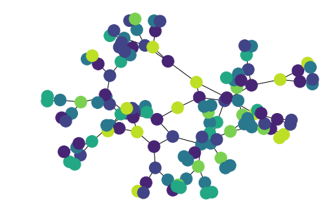
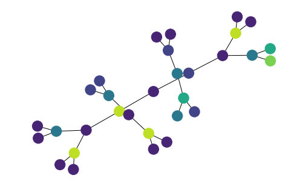
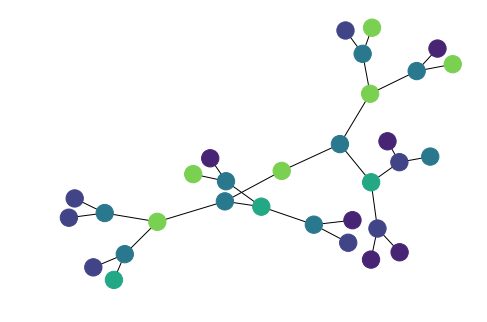
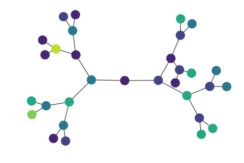
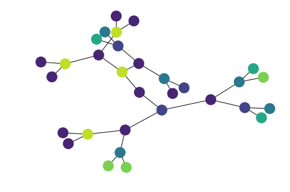

# Wave Function Collapse for Networks

This is code forked from the [Oisin](https://github.com/mewo2/oisin) implementation of WaveFunctionCollapse, which elegantly supports non-grid topologies.

In other words, we can color graphs with constraints. However, some take an exorbitant length of time to solve with this algorithm.

In our lab notebook, we've found a few good choices (low-degree nodes!) and a few bad choices (directed edges!) tentatively.

### Balanced Tree A

 

### Balanced Tree B

 

Please feel welcome to remix.